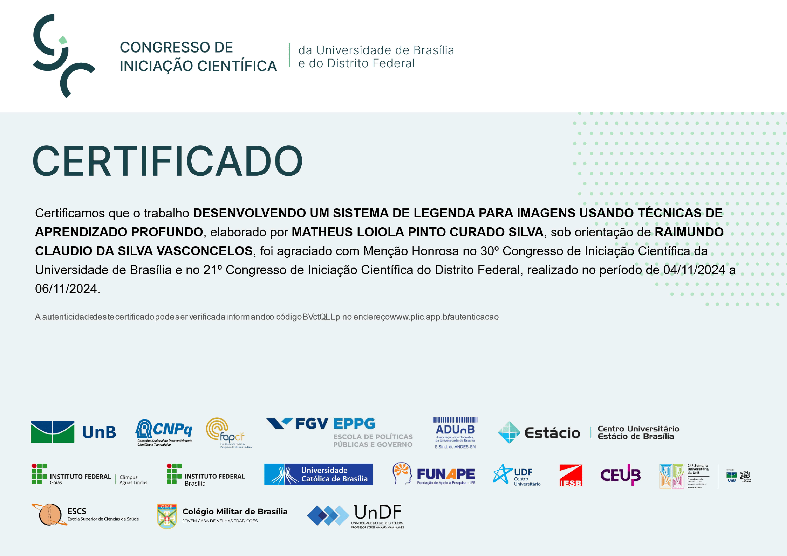

# Image Captioning System

This repository contains both the research and project implementation of an **Image Captioning System** that received an [Honourable Mention](https://ifb.edu.br/attachments/article/40369/Listas%20de%20Men%C3%A7%C3%A3o%20Honrosa%20-%20CICDF2024%20-%20IFB.pdf) at the 30th Congress of Scientific Initiation (UnB) and 21st Congress of the Federal District, Brazil. The project combines natural language processing (NLP) and computer vision techniques to generate descriptive captions for images. It explores the latest methodologies in the field, such as Convolutional Neural Networks (CNNs) for image processing and Recurrent Neural Networks (RNNs), particularly LSTMs, for text generation. 



## Table of Contents
- [Project Overview](#project-overview)
- [Installation](#installation)
- [Usage](#usage)
- [Datasets](#datasets)
- [License](#license)

## Project Overview

The image captioning system is divided into two main parts:

1. **Research**: The research section includes a detailed literature review and experiments exploring various image captioning models, architectures, and techniques.
2. **Project**: The implementation part focuses on building a working prototype using state-of-the-art deep learning models.

## Installation

To run the project locally, follow these steps:

1. Clone the repository:
   ```bash
   git clone https://github.com/loioladev/cnpq-caption-ia.git
   cd cnpq-caption-ia
   ```

2. Create a virtual environment and install dependencies:
   ```bash
   python -m venv venv
   source venv/bin/activate
   ./requirements.sh
   ```

3. Download and prepare datasets before training the models.

## Usage

The project is divided into two main parts: **YOLO Object Detection** and **LSTM Text Generation**. Each part has its own set of scripts and notebooks for training and evaluation.

## Datasets

### YOLO Datasets

The YOLO datasets are used for training the object detection model. The datasets are available in the following links:

- [COCO Dataset](https://cocodataset.org/)
- [Pascal VOC Dataset](http://host.robots.ox.ac.uk/pascal/VOC/)
- [Open Images Dataset](https://storage.googleapis.com/openimages/web/index.html)
- [ImageNet Dataset](http://www.image-net.org/)
- [LVIS Dataset](https://www.lvisdataset.org/)
- [Exclusively Dark Dataset](https://exclusivelydark.com/)

### LSTM Datasets

The LSTM datasets are used for training the text generation model. The datasets are available in the following links:

- [Flickr8k Dataset](https://www.kaggle.com/adityajn105/flickr8k)

## License

This project is licensed under the MIT License. See the [LICENSE](LICENSE) file for details.
