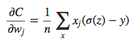

# Cross-Entropy Cost Function

A partir de agora, estudaremos um conjunto de técnicas que podem ser usadas para melhorar nossa implementação do backpropagation e, assim, melhorar a maneira como nossas redes aprendem.

As técnicas que desenvolveremos incluem: uma melhor escolha de função de custo, conhecida como função de custo de entropia cruzada (ou Cross-Entropy Cost Function); quatro métodos de “regularização” (regularização de L1 e L2, dropout e expansão artificial dos dados de treinamento), que melhoram nossas redes para generalizar além dos dados de treinamento; um método melhor para inicializar os pesos na rede; e um conjunto de heurísticas para ajudar a escolher bons hyperparâmetros para a rede.

## Função de Custo de Entropia Cruzada

Vamos supor um neurônio que receba três estradas. Nós definimos a função de custo de entropia cruzada do neurônio da seguinte forma:
$$
C = -\frac{1}{n} \sum_{x} [y \ln a + (1-y) \ln (1-a)]
$$
onde n é o número total de itens de dados de treinamento, a soma é sobre todas as entradas de treinamento x, e y é a saída desejada correspondente.

Se a saída real do neurônio estiver próxima da saída desejada para todas as entradas de treinamento x, então a entropia cruzada será próxima de zero. Para ver isso, suponha, por exemplo, que y = 0 e a ≈ 0 para alguma entrada x. Este é um caso quando o neurônio está fazendo um bom trabalho nessa entrada.

Em suma, a entropia cruzada é positiva e tende a zero, à medida que o neurônio melhora a computação da saída desejada, y, para todas as entradas de treinamento, x.

Além disso, a função custo de entropia cruzada tem o benefício de que, ao contrário do custo quadrático, evita o problema de desaceleração do aprendizado.

Acima podemos ver a derivada parcial do custo, utilizada para o backpropagation.