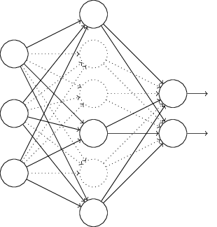

# Dropout

Dropout é uma técnica radicalmente diferente para regularização. Começamos por eliminar aleatoriamente (e temporariamente) alguns dos neurônios ocultos na rede, deixando os neurônios de entrada e saída intocados. Depois de fazer isso, terminaremos com uma rede da seguinte forma (observe as linhas tracejadas na figura abaixo). Note os neurônios que foram temporariamente eliminados:

Nós encaminhamos para frente a entrada x através da rede modificada, e depois retropropagamos o resultado, também através da rede modificada. Depois de fazer isso em um mini-lote de exemplos, atualizamos os pesos e vieses apropriados. Em seguida, repetimos o processo, primeiro restaurando os neurônios removidos, depois escolhendo um novo subconjunto aleatório de neurônios ocultos para excluir, estimando o gradiente para um mini-lote diferente e atualizando os pesos e vieses na rede.

Ao repetir esse processo várias vezes, nossa rede aprenderá um conjunto de pesos e vieses. Naturalmente, esses pesos e vieses terão sido aprendidos sob condições em que parte dos neurônios ocultos foram descartados. Quando realmente executamos a rede completa, isso significa que mais neurônios ocultos estarão ativos. Para compensar isso, reduzimos pela metade os pesos que saem dos neurônios ocultos.

Uma explicação heurística relacionada ao Dropout é dada em um dos primeiros artigos a usar a técnica: “Esta técnica reduz co-adaptações complexas de neurônios, já que um neurônio não pode confiar na presença de outros neurônios em particular. É, portanto, forçado a aprenda recursos mais robustos que são úteis em conjunto com muitos subconjuntos aleatórios diferentes dos outros neurônios”. 

Nesse ponto, é um pouco semelhante à Regularização L1 e L2, que tendem a reduzir os pesos e, assim, tornar a rede mais robusta para perder qualquer conexão individual na rede.
