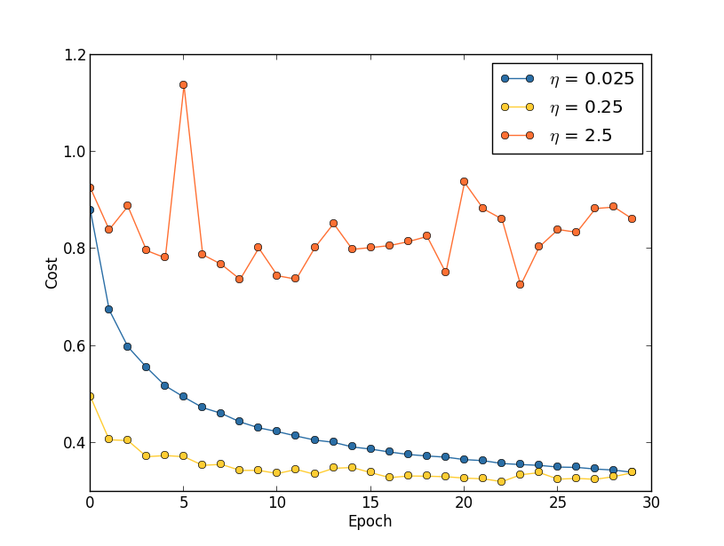

# Taxa de Aprendizado

Primeiro, estimamos o valor limite para η no qual o custo nos dados de treinamento começa imediatamente a diminuir, em vez de oscilar ou aumentar. Essa estimativa não tem que ser muito precisa. Você pode estimar a ordem de magnitude começando com η = 0.01. Se o custo diminuir durante as primeiras épocas, então você deve sucessivamente tentar η = 0.1, 1.0,… até encontrar um valor para η onde o custo oscile ou aumente durante as primeiras poucas épocas

Alternativamente, se o custo oscilar ou aumentar durante as primeiras épocas, quando η = 0.01, então tente η = 0.001 ,0.0001,… até encontrar um valor para η onde o custo diminui durante as primeiras poucas épocas. Seguindo este procedimento, obteremos uma estimativa da ordem de magnitude para o valor limite de η. 

Obviamente, o valor real de η que você usa não deve ser maior que o valor limite. De fato, se o valor de η permanecer utilizável ao longo de muitas épocas, então você provavelmente desejará usar um valor para η que seja menor, digamos, um fator de dois abaixo do limite. Essa escolha normalmente permitirá que você treine por muitas épocas, sem causar muita lentidão no aprendizado.

# Early Stopping 

![Early Stopping][./earlystopping.png]

Usar Early Stopping significa que, no final de cada época, devemos calcular a precisão da classificação nos dados de validação. Quando a precisão parar de melhorar, terminamos o treinamento. 

Se você está tentando obter um desempenho realmente bom, a regra de “parar o treinamento se não melhorar em dez épocas” pode ser muito agressiva. Nesse caso, sugerimos usar essa regra para a experimentação inicial e, gradualmente, adotar regras mais brandas, conforme entender melhor a maneira como sua rede treina: sem melhoria em vinte épocas, sem melhoria em cinquenta épocas e assim por diante. 
