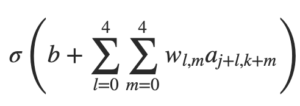
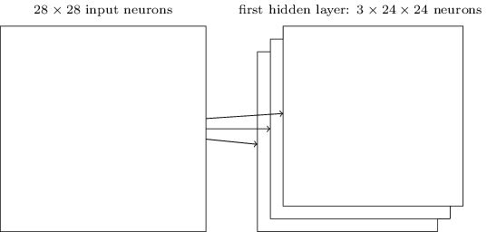

# Compartilhamento de Pesos em Redes Neurais Convolucionais

Já dissemos que cada neurônio tem um viés e pesos 5 × 5 conectados ao seu campo receptivo local. O que eu não mencionamos é que vamos usar os mesmos pesos e vieses para cada um dos 24 × 24 neurônios ocultos. Em outras palavras, para o neurônio oculto, a saída é:

Isso significa que todos os neurônios da primeira camada oculta detectam exatamente o mesmo recurso, apenas em locais diferentes na imagem de entrada. Para entender porque isso faz sentido, suponha que os pesos e os vieses sejam tais que o neurônio oculto possa escolher, digamos, uma borda vertical em um campo receptivo local específico. Essa habilidade também é útil em outros lugares da imagem. Por isso, é útil aplicar o mesmo detector de recursos em toda a imagem. Para colocar esse conceito em termos um pouco mais abstratos, as redes convolucionais são bem adaptadas à invariância da transalação das imagens: girar uma foto de um gato 90 graus, ainda faz dela a imagem de um gato, embora os pixels agora estejam organizados de forma diferente.

A estrutura de rede que descrevemos até agora pode detectar apenas um único tipo de recurso localizado. Para fazer reconhecimento de imagem, precisaremos de mais de um mapa de recursos. E assim, uma camada convolucional completa consiste em vários mapas de recursos, diferentes:

No exemplo mostrado acima, existem 3 mapas de recursos. Cada mapa de recursos é definido por um conjunto de pesos compartilhados de 5 × 5 e um único viés compartilhado. O resultado é que a rede pode detectar três tipos diferentes de recursos, sendo cada recurso detectável em toda a imagem.

No exemplo temos apenas 3 mapas de recursos, para manter o diagrama acima simples. No entanto, na prática, as redes convolucionais podem usar mais (e talvez muito mais) mapas de recursos.

