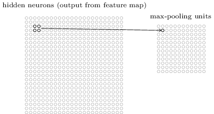
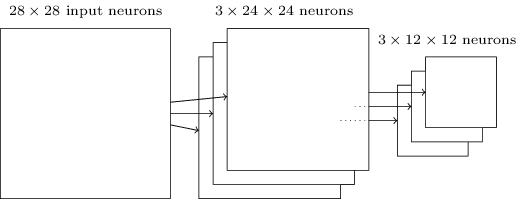
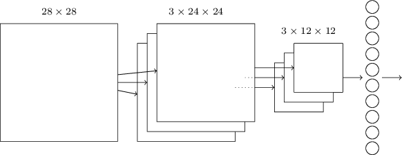

# Camadas de Pooling em Redes Neurais Convolucionais

Camadas de Pooling são geralmente usadas imediatamente após camadas convolucionais e o que fazem é simplificar as informações na saída da camada convolucional. 

Uma camada de pooling recebe cada saída do mapa de características da camada convolucional e prepara um mapa de características condensadas. Por exemplo, cada unidade na camada de pooling pode resumir uma região de (digamos) 2 × 2 neurônios na camada anterior. Como um exemplo concreto, um procedimento comum para o pooling é conhecido como pool máximo (ou Max-Pooling). No Max-Pooling, uma unidade de pooling simplesmente gera a ativação máxima na região de entrada 2 × 2, conforme ilustrado no diagrama a seguir:

Note que, como temos 24 × 24 neurônios emitidos da camada convolucional, após o agrupamento, temos 12 × 12 neurônios.

Como mencionado acima, a camada convolucional geralmente envolve mais do que um único mapa de características. Aplicamos o Max-Pooling para cada mapa de recursos separadamente. Portanto, se houvesse três mapas de recursos, as camadas combinadas, convolutional e Max-Pooling, se pareceriam com:

Podemos pensar em Max-Pooling como uma forma de a rede perguntar se um determinado recurso é encontrado em qualquer lugar de uma região da imagem. Em seguida, elimina a informação posicional exata. A intuição é que, uma vez que um recurso tenha sido encontrado, sua localização exata não é tão importante quanto sua localização aproximada em relação a outros recursos. Um grande benefício é que há muito menos recursos agrupados e, portanto, isso ajuda a reduzir o número de parâmetros necessários nas camadas posteriores. 

O Max-Pooling não é a única técnica usada para o pooling. Outra abordagem comum é conhecida como Pooling L2. Aqui, em vez de tomar a ativação máxima de uma região 2 × 2 de neurônios, tomamos a raiz quadrada da soma dos quadrados das ativações na região 2 × 2. 

## Juntando tudo

Podemos agora juntar todas essas ideias para formar uma rede neural convolucional completa. 

A rede começa com 28 × 28 neurônios de entrada (cada image de cada dígito do dataset MNIST tem 28 x 28 pixels), que são usados ​​para codificar as intensidades de pixel para uma imagem no dataset MNIST. Este é então seguido por uma camada convolucional usando um campo receptivo local de 5 x 5 e três mapas de características. O resultado é uma camada de 3 × 24 × 24 neurônios ocultos. A próxima etapa é uma camada de Max-Pooling, aplicada a regiões 2 × 2, em cada um dos três mapas de recursos. O resultado é uma camada de 3 × 12 × 12 neurônios ocultos.

A camada final de conexões na rede é uma camada totalmente conectada. Ou seja, essa camada conecta todos os neurônios da camada de max-pooling a cada um dos 10 neurônios de saída.