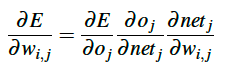

# Algoritmo Backpropagation

## Introdução

O backpropagation é indiscutivelmente o algoritmo mais importante na história das redes neurais – sem backpropagation, seria quase impossível treinar redes de aprendizagem profunda da forma que vemos hoje. 

O algoritmo de backpropagation consiste em duas fases:

1. O passo para frente (forward pass), onde nossas entradas são passadas através da rede e as previsões de saída obtidas.

2. O passo para trás (backward pass), onde calculamos o gradiente da função de perda na camada final (ou seja, camada de previsão) da rede e usamos esse gradiente para aplicar recursivamente a regra da cadeia (chain rule) para atualizar os pesos em nossa rede.

## Forward Pass

O propósito do passo para frente é propagar nossas entradas (os dados de entrada) através da rede aplicando uma série de dot products (multiplicação entre os vetores) e ativações até chegarmos à camada de saída da rede (ou seja, nossas previsões). 

Para isso, basta somarmos a multiplicação entre os pesos com os valores a serem recebidos das camadas anteriores, e adicionar o bias.

## Backpropagtion

O objetivo do backpropagation é otimizar os pesos para que a rede neural possa aprender a mapear corretamente as entradas para as saídas.

Para aplicar o algoritmo de backpropagation, nossa função de ativação deve ser diferenciável, de modo que possamos calcular a derivada parcial do erro em relação a um dado peso wi,j, loss(E), saída de nó oj e saída de rede j.

*Pesquisar mais sobre backpropagation*

