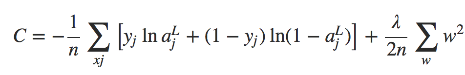
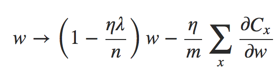

# Regularização L2

Aumentar a quantidade de dados de treinamento é uma maneira de reduzir o overfitting. Mas existem outras maneiras de reduzir a extensão de ocorrência do overfitting? Existem técnicas que são conhecidas como técnicas de regularização, e que podem reduzir o overfitting, mesmo quando temos uma rede de tamanho fixo e dados de treinamento em quantidade limitada.

Uma técnica às vezes conhecida como decaimento de peso (weight decay) ou Regularização L2, e sua ideia é adicionar um termo extra à função de custo, um termo chamado termo de regularização.

O primeiro termo é apenas a expressão usual para a entropia cruzada. Mas adicionamos um segundo termo, a soma dos quadrados de todos os pesos da rede. Isto é escalonado por um fator λ / 2n, onde λ > 0 é conhecido como o parâmetro de regularização e n é, como de costume, o tamanho do nosso conjunto de treinamento.

Onde a soma é sobre exemplos de treinamento x no mini-lote, e Cx é o custo (não-regularizado) para cada exemplo de treinamento.  Isto é exatamente o mesmo que a regra usual para descida de gradiente estocástico, exceto pelo fator de decaimento de peso de 1 − (ηλ/n).  Esse reescalonamento é, às vezes, chamado de redução de peso, uma vez que diminui os pesos.

Heuristicamente, se a função de custo for desregularizada, o comprimento do vetor de peso provavelmente crescerá, todas as outras coisas sendo iguais. Com o tempo, isso pode levar o vetor de peso a ser realmente muito grande. Isso pode fazer com que o vetor de peso fique preso apontando mais ou menos na mesma direção, já que as mudanças devido a descida do gradiente fazem apenas pequenas alterações na direção, quando o comprimento é longo.

# Por quê reduz o overfitting?

Pense no exemplo de criar uma função que passe por certos pontos de um plano cartesiano. Ao utilizar uma função polinomial de ordem n-1, onde n é a quantidade de pontos, conseguimos passar exatamente por todos os pontos. Entretanto, se utilizarmos uma função de ordem menor, podemos aproximar esses pontos. Agora imagine que tenhamos um novo ponto de escala muito maior que os anteriores, qual das funções seria a melhor para estimar o valor desse ponto? Provavelmente a segunda função.

Vamos ver o que esse ponto de vista significa para redes neurais. Suponha que nossa rede tenha, na maioria das vezes, pequenos pesos, como tenderá a acontecer em uma rede regularizada. O tamanho menor dos pesos significa que o comportamento da rede não mudará muito se alterarmos algumas entradas aleatórias aqui e ali. Isso dificulta que uma rede regularizada aprenda os efeitos do ruído local nos dados. Pense nisso como uma maneira de fazer com que as evidências não importem muito para a saída da rede. Em vez disso, uma rede regularizada aprende a responder a tipos de evidências que são vistas com frequência em todo o conjunto de treinamento. Por outro lado, uma rede com grandes pesos pode alterar bastante seu comportamento em resposta a pequenas alterações na entrada. Assim, uma rede não regularizada pode usar grandes pesos para aprender um modelo complexo que contém muitas informações sobre o ruído nos dados de treinamento. Em suma, as redes regularizadas são levadas a construir modelos relativamente simples baseados em padrões vistos frequentemente nos dados de treinamento e são resistentes às peculiaridades de aprendizagem do ruído nos dados de treinamento. A esperança é que isso forçará nossas redes a aprender de verdade sobre o fenômeno em questão e a generalizar melhor o que aprendem.

Com isso dito, e mantendo a necessidade de cautela em mente, é um fato empírico que as redes neurais regularizadas geralmente generalizam melhor do que as redes não regularizadas. oi conjecturado que “a dinâmica do aprendizado de gradiente descendente em redes multicamadas tem um efeito de ‘autorregulação'”.

Deixe-me concluir esta seção voltando a um detalhe que deixei inexplicado antes: o fato de que a regularização L2 não restringe os vieses. É claro que seria fácil modificar o procedimento de regularização para regularizar os vieses. Empiricamente, fazendo isso muitas vezes não muda muito os resultados, então, em certa medida, é apenas uma convenção se regularizar os vieses ou não. No entanto, vale a pena notar que ter um grande viés não torna um neurônio sensível às suas entradas da mesma maneira que ter pesos grandes. Portanto, não precisamos nos preocupar com grandes vieses que permitem que nossa rede aprenda o ruído em nossos dados de treinamento. Ao mesmo tempo, permitir grandes vieses dá às nossas redes mais flexibilidade no comportamento – em particular, grandes vieses facilitam a saturação dos neurônios, o que às vezes é desejável. Por essas razões, geralmente não incluímos termos de viés quando regularizamos a rede neural.