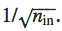

# Inicialização de Pesos

amos supor, por simplicidade, que estamos tentando treinar usando uma entrada de treinamento x na qual metade dos neurônios de entrada estão ativados, isto é, configurados para 1, e metade dos neurônios de entrada estão desligados, ou seja, ajustados para 0. O argumento a seguir aplica-se de forma mais geral, mas você obterá a essência deste caso especial. Vamos considerar a soma ponderada z = ∑jwjxj + b de entradas para nosso neurônio oculto. Ocorre que 500 termos nesta soma desaparecem, porque a entrada correspondente xj é zero e, assim, z é uma soma sobre um total de 501 variáveis aleatórias Gaussianas normalizadas, representando os 500 termos de peso e o termo extra de viés (bias). Logo, z é ele próprio uma distribuição Gaussiana com média zero e desvio padrão ≈ 22.4 (raiz quadrada de 501). 

Como resultado, esses pesos só aprenderão muito lentamente quando usarmos o algoritmo de descida do gradiente. Existe alguma maneira de escolhermos melhores inicializações para os pesos e vieses, para que não tenhamos esse tipo de saturação e, assim, evitar uma desaceleração na aprendizagem? Suponha que tenhamos um neurônio com pesos de entrada nin. Então, inicializaremos esses pesos como variáveis ​​aleatórias gaussianas com média 0 e desvio padrão:

Isto é, vamos “esmagar os gaussianos”, tornando menos provável que nosso neurônio seja saturado. Continuaremos a escolher o viés como um Gaussiano com média 0 e desvio padrão 1. Com essas escolhas, a soma ponderada z = ∑jwjxj + b será novamente uma variável aleatória Gaussiana com média 0, mas será muito mais aguda que antes. É muito menos provável que tal neurônio sature e, correspondentemente, é muito menos provável que tenha problemas com a lentidão do aprendizado.

**Utilizando essa inicialização, não é apenas a velocidade de aprendizado que é melhorada, mas também o desempenho final.**