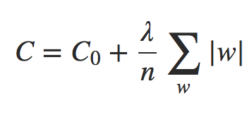

# Regularização L1

Intuitivamente, isso é semelhante à Regularização L2, penalizando grandes pesos e tendendo a fazer com que a rede prefira pequenos pesos. Naturalmente, o termo de Regularização L1 não é o mesmo que o termo de Regularização L2 e, portanto, não devemos esperar obter exatamente o mesmo comportamento.

Na Regularização L1, os pesos diminuem em uma quantidade constante para 0. Na Regularização L2, os pesos diminuem em um valor proporcional a w. E assim, quando um peso específico tem uma grande magnitude, a Regularização L1 reduz o peso muito menos do que a Regularização L2. Em contraste, quando |w| é pequena, a Regularização L1 reduz o peso muito mais do que a Regularização L2. O resultado é que a Regularização L1 tende a concentrar o peso da rede em um número relativamente pequeno de conexões de alta importância, enquanto os outros pesos são direcionados para zero.

