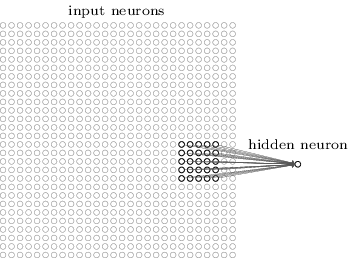
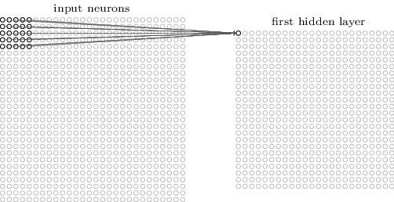

# Campos Receptivos Locais em Redes Neurais Convolucionais

## O Que é Visão Computacional?

A Visão Computacional é o processo de modelagem e replicação da visão humana usando software e hardware. A Visão Computacional é uma disciplina que estuda como reconstruir, interromper e compreender uma cena 3d a partir de suas imagens 2d em termos das propriedades da estrutura presente na cena.

Visão Computacional e reconhecimento de imagem são termos frequentemente usados como sinônimos, mas o primeiro abrange mais do que apenas analisar imagens. Isso porque, mesmo para os seres humanos, “ver” também envolve a percepção em muitas outras frentes, juntamente com uma série de análises. Cada ser humano usa cerca de dois terços do seu cérebro para o processamento visual, por isso não é nenhuma surpresa que os computadores precisariam usar mais do que apenas o reconhecimento de imagem para obter sua visão de forma correta.

## Campos Receptivos Locais

Como de costume, vamos conectar os pixels de entrada a uma camada de neurônios ocultos. Mas não vamos conectar todos os pixels de entrada a cada neurônio oculto. Em vez disso, apenas fazemos conexões em regiões pequenas e localizadas da imagem de entrada.

Para ser mais preciso, cada neurônio na primeira camada oculta será conectado a uma pequena região dos neurônios de entrada, digamos, por exemplo, uma região de 5 × 5, correspondendo a 25 pixels de entrada. Assim, para um neurônio oculto em particular, podemos ter conexões que se parecem com isso:

Essa região na imagem de entrada é chamada de campo receptivo local para o neurônio oculto. É uma pequena janela nos pixels de entrada. Cada conexão aprende um peso e o neurônio oculto também aprende um viés (bias) geral. Você pode pensar nesse neurônio oculto particular como aprendendo a analisar seu campo receptivo local específico.

Em seguida, deslizamos o campo receptivo local por toda a imagem de entrada. Para cada campo receptivo local, existe um neurônio oculto diferente na primeira camada oculta. Para ilustrar isso concretamente, vamos começar com um campo receptivo local no canto superior esquerdo:

E podemos mover esse campo receptivo até preenchermos todas as camadas ocultas. Mostramos o campo receptivo local sendo movido por um pixel por vez. Na verdade, às vezes, um comprimento de passada diferente é usado. Por exemplo, podemos mover o campo receptivo local 2 pixels para a direita (ou para baixo), caso em que diríamos que um comprimento de passada de 2 é usado. Esse é um dos hyperparâmetros de uma rede neural convolucional, chamado stride length. No exemplo acima usado um stride length de 1, mas vale a pena saber que as pessoas às vezes experimentam comprimentos de passada diferentes.

